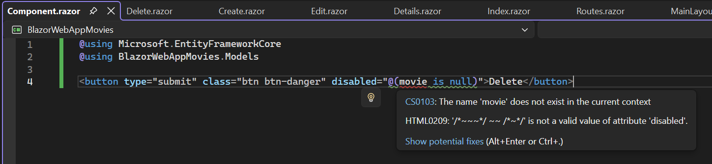

# BlazorTraining

Training in ASP.NET Core using Blazor

Starting with the instructions here:

https://dotnet.microsoft.com/en-us/learn/aspnet/blazor-tutorial/intro

There are some remarks in the Solution where things were changed from the sample code and longer form comments about the sample code and issues found here.

## Part 2 - Add and scaffold a model

https://learn.microsoft.com/en-gb/aspnet/core/blazor/tutorials/movie-database-app/part-2?view=aspnetcore-8.0&pivots=vs

Note this part of the URL, it's not clear if there is a difference here but see a later URL which is linked in the later instructions where this is explicitly for .NET 10 rather than ```view=aspnetcore-8.0```

### Create the initial database schema using EF Core's migration feature failed?

Something went wrong with the "Add Migration" of "InitialCreate" where it accepted the name and loaded the database context the first time, but suggested it needed a ```--force``` parameter to make the changes.

After restarting Visual Studio the error persisted, running the command from the command line rather than the VS IDE gave an error message which could be copied and pasted here:

```
C:\git\BlazorTraining\BlazorWebAppMovies\BlazorWebAppMovies>dotnet new tool-manifest
Creating this template will make changes to existing files:
  Overwrite   ./dotnet-tools.json

To create the template anyway, run the command with '--force' option:
   dotnet new tool-manifest --force

For details on the exit code, refer to https://aka.ms/templating-exit-codes#73
```

Adding the ```--force``` parameter fixed this issue.

```
C:\git\BlazorTraining\BlazorWebAppMovies\BlazorWebAppMovies>dotnet new tool-manifest --force
The template "Dotnet local tool manifest file" was created successfully.
```

This created a new "dotnet-tools.json" file with this content although it didn't resolve the issue where the migration could take place in the UI.

```
{
  "version": 1,
  "isRoot": true,
  "tools": {}
}
```

I don't particularly like the "code first" approach so this was abandoned and a SQL Server Database Project was added to the solution instead.

### Certificate issues using a local database published from a SQL Server Database Project

Creating a new database on a local SQL Server instance using a SQL Server Database Project and updating the connection string in the application to use this rather than localdb gave an error:

```
An unhandled exception occurred while processing the request.
Win32Exception: The certificate chain was issued by an authority that is not trusted.
Unknown location

SqlException: A connection was successfully established with the server, but then an error occurred during the login process. (provider: SSL Provider, error: 0 - The certificate chain was issued by an authority that is not trusted.)
Microsoft.Data.SqlClient.SqlInternalConnection.OnError(SqlException exception, bool breakConnection, Action<Action> wrapCloseInAction)
```

This offers a temporary solution of adding ```TrustServerCertificate=True``` to the connection string.

https://stackoverflow.com/questions/17615260/the-certificate-chain-was-issued-by-an-authority-that-is-not-trusted-when-conn

## Part 3 - Learn about Razor components

https://learn.microsoft.com/en-gb/aspnet/core/blazor/tutorials/movie-database-app/part-3?view=aspnetcore-8.0&pivots=vs

And there is a .NET Core 10 version of this page here I should have been following, did I miss something else in an earlier page?

https://learn.microsoft.com/en-gb/aspnet/core/blazor/tutorials/movie-database-app/part-3?view=aspnetcore-10.0&pivots=vs&preserve-view=true#details-component

### Example code doesn't include the "counter" page in the sample code

A very minor observation, replacing the code in ```Components/Layout/NavMenu.razor``` with this from the page linked would remove the navigation link to the counter page?

```
<div class="top-row ps-3 navbar navbar-dark">
    <div class="container-fluid">
        <a class="navbar-brand" href="">Sci-fi Movies</a>
    </div>
</div>

<input type="checkbox" title="Navigation menu" class="navbar-toggler" />

<div class="nav-scrollable" onclick="document.querySelector('.navbar-toggler').click()">
    <nav class="nav flex-column">
        <div class="nav-item px-3">
            <NavLink class="nav-link" href="" Match="NavLinkMatch.All">
                <span class="bi bi-house-door-fill-nav-menu" aria-hidden="true"></span> Home
            </NavLink>
        </div>

        <div class="nav-item px-3">
            <NavLink class="nav-link" href="weather">
                <span class="bi bi-list-nested-nav-menu" aria-hidden="true"></span> Weather
            </NavLink>
        </div>

        <div class="nav-item px-3">
            <NavLink class="nav-link" href="movies">
                <span class="bi bi-list-nested-nav-menu" aria-hidden="true"></span> Movies
            </NavLink>
        </div>
    </nav>
</div>
```

### Suggested refactoring on the Delete page is not valid

This part of the sample code ```disabled="@(movie is null)"``` had a suggested refactoring.

```
        <EditForm method="post" Model="movie" OnValidSubmit="DeleteMovie" FormName="delete" Enhance>
            <button type="submit" class="btn btn-danger" disabled="@(movie is null)">Delete</button> |
            <a href="/movies">Back to List</a>
        </EditForm>
```

But this just creates a new Component which is perhaps more readable but it's still complaining about the 'disabled' attribute.



Something either in the VS IDE or one of the extensions I have installed isn't happy with this syntax, this suggested refactoring will be ignored.

## TODO

Validation of the Movie at both the model and database level: Title should be 255 characters at most. ReleaseDate should be "sensible" ([Wikipedia History_of_film](https://en.wikipedia.org/wiki/History_of_film) suggests 1894 could be a minimum value). Genre should be 50 characters at most. Price should not be negative. Check we can't include HTML tags into text columns or carry out script injection when editing and creating.

Properly resolve the ```TrustServerCertificate=True``` issue, as this is only a development sandbox this is possibly a "fix never" issue or might be covered later in the Blazor training instructions.

Multiple Genre for a Movie? Separate Combo Box with a list of existing Genre to choose from and the ability to ad-hoc create new ones. Update the Create and Edit pages to include this. New model and database table.

## Original local DB connection string

```
"BlazorWebAppMoviesContext": "Server=(localdb)\\mssqllocaldb;Database=BlazorWebAppMoviesContext-c3a5fbd7-c1b2-4078-b26f-7338cdb431b9;Trusted_Connection=True;MultipleActiveResultSets=true"
```